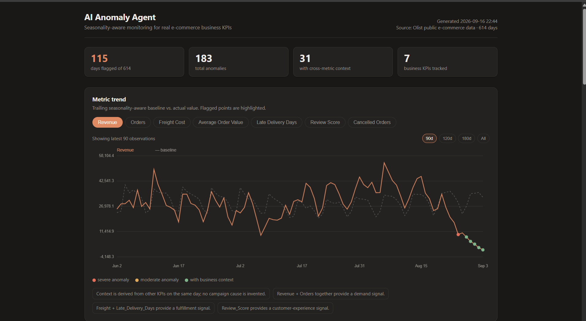

# AI Anomaly Agent

> Explainable e-commerce anomaly detection using seasonality-aware statistics, machine learning, and cross-metric business context.

[](https://www.python.org/)
[](https://scikit-learn.org/)
[](https://github.com/features/actions)

### 🚀 [Live Dashboard](https://namittyagi.github.io/ai-anomaly-agent/)

An end-to-end analytics monitoring system built around the **Brazilian E-Commerce Public Dataset by Olist**.

The system transforms raw e-commerce data into daily business KPIs, detects unusual movements using a seasonality-aware statistical baseline, uses Isolation Forest as an independent machine-learning signal, and provides explainable business context from related KPIs.

---

## 📊 Dashboard



The dashboard monitors **614 days of e-commerce activity across 7 business KPIs** and highlights unusual movements for investigation.

**[🚀 Open the Live Dashboard →](https://namittyagi.github.io/ai-anomaly-agent/)**

---

## 🎯 Business Problem

E-commerce teams monitor multiple KPIs every day, but manually identifying unusual changes can be time-consuming.

This project asks:

- Which KPIs are behaving unusually?
- How unusual is the movement compared with historical behavior?
- Are multiple KPIs moving together?
- Does the evidence suggest a demand, fulfillment, or customer-experience issue?
- Which anomalies require investigation?

The goal is to move from **"something looks strange"** to a structured and explainable monitoring signal.

---

## ✨ Key Features

- Seasonality-aware anomaly detection
- Weekday-specific historical baselines
- Trend-aware residual analysis
- Isolation Forest ML support layer
- Cross-metric business context
- Explainable anomaly summaries
- SQLite alert history
- Alert feedback mechanism
- Automated regression tests
- Automated dashboard generation
- GitHub Actions workflow
- Reproducible data pipeline

---

## 📈 KPIs Monitored

The pipeline converts raw Olist data into daily business metrics.

| KPI | Business Signal |
|---|---|
| Revenue | Overall sales performance |
| Orders | Demand activity |
| Average Order Value | Customer purchase value |
| Freight Cost | Fulfillment cost |
| Late Delivery Days | Delivery performance |
| Review Score | Customer experience |
| Cancelled Orders | Order health |

---

## 🧠 Detection Approach

### 1. Seasonality-Aware Statistical Detection

A simple rolling average can repeatedly flag normal weekday/weekend behavior.

Instead, the system compares observations with historical values from the **same weekday** while also accounting for local trend.

The detector uses:

- Historical same-weekday observations
- Robust residual scaling
- Minimum relative-change thresholds
- Minimum history requirements

This makes the alert logic more transparent and reduces noisy alerts.

### 2. Isolation Forest

An **Isolation Forest** provides an independent machine-learning signal.

It is used as a supporting layer rather than replacing the statistical detector.

```text
Statistical baseline
        +
Isolation Forest
        ↓
Anomaly evidence
```

### 3. Cross-Metric Business Context

The system checks whether related KPIs moved on the same day.

Examples:

```text
Revenue + Orders
        ↓
Demand signal

Freight Cost + Late Delivery Days
        ↓
Fulfillment signal

Review Score + Late Delivery Days
        ↓
Customer-experience signal

Cancelled Orders + Orders
        ↓
Order-health signal
```

These relationships do **not** prove the root cause.

They provide supporting evidence that helps an analyst decide where to investigate.

---

## 🏗️ Architecture

```text
Olist Public Dataset
        |
        v
Download Raw Data
        |
        v
Daily KPI Transformation
        |
        v
Seasonality-Aware Detector
        |
        +--------> Isolation Forest
        |
        v
Cross-Metric Context
        |
        v
Business Explanation
        |
        v
SQLite Alert History
        |
        v
Dashboard Data
        |
        v
Interactive Dashboard
        |
        v
GitHub Actions
```

---

## 🗂️ Dataset

This project uses the **Brazilian E-Commerce Public Dataset by Olist**.

The dataset contains approximately 100,000 anonymized orders from the Brazilian e-commerce marketplace and includes information about orders, products, sellers, freight, payments, and customer reviews.

The current KPI pipeline uses three source tables:

- Orders
- Order Items
- Order Reviews

The raw dataset is **not committed to this repository**. It is downloaded by the pipeline so the project remains reproducible without storing large raw files in Git.

### Dataset Sources

- [Olist Brazilian E-Commerce Public Dataset](https://www.kaggle.com/datasets/olistbr/brazilian-ecommerce)
- [Olist Public Data Repository](https://github.com/olist/work-at-olist-data)

---

## 📊 Results

The current pipeline processes:

- **614 days** of e-commerce activity
- **7 business KPIs**
- **183 detected anomalies**
- **115 days containing flagged activity**
- **31 anomalies with cross-metric business context**

The dashboard allows the analyst to switch between all seven KPIs and inspect different time windows.

Available windows:

- 90 days
- 120 days
- 180 days
- Full dataset

---

## 🔄 Alert Feedback Loop

Detected alerts are stored in SQLite.

An analyst can provide feedback such as:

```bash
python anomaly_agent.py --feedback 14 false_positive
python anomaly_agent.py --feedback 14 reviewed
```

Repeated false-positive feedback can increase the threshold for a specific metric/weekday combination.

Alert writes are idempotent, so rerunning the same dataset does not continuously create duplicate alerts.

---

## 🌐 Dashboard

The dashboard is custom-built rather than dependent on Power BI or Tableau.

### Frontend

- HTML
- CSS
- JavaScript
- Canvas-based visualization

### Data Layer

Python generates a JSON data contract consumed by the dashboard.

This keeps the demonstration portable and allows the dashboard to be generated automatically as part of the pipeline.

### Live Demo

**[🚀 Open the AI Anomaly Agent Dashboard](https://namittyagi.github.io/ai-anomaly-agent/)**

---

## ⚙️ Automated Workflow

GitHub Actions can execute the monitoring pipeline automatically:

```text
Download public Olist data
        ↓
Build daily KPI layer
        ↓
Run anomaly detection
        ↓
Generate dashboard
        ↓
Run validation checks
        ↓
Deploy dashboard
```

Because Olist is a historical dataset, the workflow demonstrates **scheduled reproducible reprocessing**, not a live production data feed.

---

## 📁 Project Structure

```text
ai-anomaly-agent/
│
├── .github/
│   └── workflows/
│       ├── daily_check.yml
│       └── pages.yml
│
├── data/
│   ├── raw/
│   └── processed/
│
├── docs/
│   └── dashboard.png
│
├── alert_store.py
├── anomaly_agent.py
├── build_dashboard.py
├── config.yaml
├── download_olist_data.py
├── ml_anomaly.py
├── olist_pipeline.py
├── run_all.py
├── test_agent.py
├── dashboard.html
├── dashboard_data.json
├── index.html
├── requirements.txt
└── README.md
```

---

## 🚀 Run Locally

### 1. Install dependencies

```bash
pip install -r requirements.txt
```

### 2. Download the Olist dataset

```bash
python download_olist_data.py
```

### 3. Build daily KPIs

```bash
python olist_pipeline.py
```

### 4. Run anomaly detection

```bash
python anomaly_agent.py
```

### 5. Build the dashboard

```bash
python build_dashboard.py
```

Then open `dashboard.html` in a browser.

### Or run the complete pipeline

```bash
python run_all.py
```

This runs the complete workflow and executes the regression checks.

---

## 🧪 Testing

The project includes automated regression tests using an Olist-shaped test fixture.

Run:

```bash
python test_agent.py
```

The tests validate the transformation and anomaly-detection logic without requiring the complete raw dataset.

---

## 🛠️ Tech Stack

### Data & Machine Learning

- Python
- Pandas
- NumPy
- Scikit-learn

### Storage

- SQLite
- CSV
- JSON

### Dashboard

- HTML
- CSS
- JavaScript
- Canvas API

### Automation & Deployment

- GitHub Actions
- GitHub Pages

---

## ⚠️ Limitations

This project is designed as an analytics monitoring prototype rather than a production monitoring platform.

Current limitations include:

- Historical Olist data rather than a live data source
- Three source tables currently used for KPI generation
- SQLite instead of a production data warehouse
- Deterministic business-context rules instead of an LLM
- Anomaly signals do not prove the underlying root cause

---

## 🔮 Future Improvements

Potential extensions include:

- Add payment and seller-level KPIs
- Add category and seller anomaly drill-down
- Add live API or warehouse integration
- Add email or Slack notifications
- Add richer root-cause analysis
- Add EWMA and other adaptive baselines
- Add optional LLM-generated explanations using structured evidence
- Add production model monitoring

---

## 💬 Interview Highlights

### Why not just use Power BI?

> The goal was to build the monitoring logic itself. The dashboard is the presentation layer; Python handles the data transformation, anomaly detection, ML support, alert history, and dashboard generation.

### Why use same-weekday baselines?

> A generic rolling average can treat normal weekend behavior as anomalous. Comparing observations with previous observations from the same weekday creates a more representative and explainable baseline.

### Why use Isolation Forest?

> Isolation Forest provides an independent ML signal without making the final alert decision a complete black box. The statistical detector remains the primary decision layer.

### Does the system identify the root cause?

> No. It identifies unusual behavior and provides evidence from related KPIs. The contextual signals help an analyst investigate possible causes rather than claiming a proven root cause..

---

## 👨‍💻 Author

**Namit Tyagi**

Computer Science & Engineering — Data Science

[GitHub](https://github.com/NamitTyagi)
